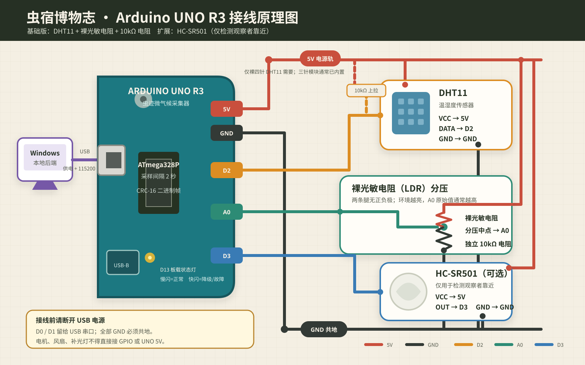
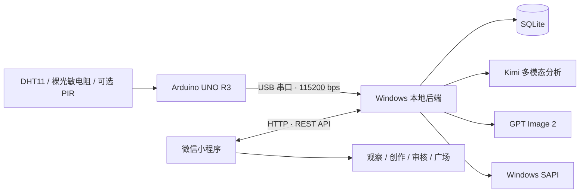

# 虫宿博物志 · AI 自然观察站

> 把一只真实遇见的昆虫，变成可测量、可讲述、可分享的自然观察记录。

“虫迹中国”是一套面向儿童自然教育、乡村美育与公众科学体验的软硬件原型。Arduino UNO 采集观察点的温度、湿度和相对光照，Windows 本地服务负责串口、数据、AI、语音与图片合成，微信小程序完成拍摄、观察、作品创作和城乡交流。

当前仓库为 **MVP（v0.1.0）**：没有硬件、没有 API 密钥时可运行完整演示流程；接入 Arduino 与服务凭证后，可切换为真实采集和真实 AI 服务。



## 功能概览

- **微气候采集**：Arduino UNO + DHT11 + 裸光敏电阻分压，每 2 秒上报温度、湿度和相对光照；可选 HC-SR501 检测观察者靠近。
- **现场观察**：小程序引导儿童拍摄昆虫、记录时间地点、口述发现，并冻结拍摄瞬间的环境数据。
- **AI 辅助识别**：返回多个候选、可观察特征和安全提示，不把模型判断包装成确定的物种鉴定。
- **自然创作**：调用 `gpt-image-2` 生成昆虫插画，再合成自然明信片或博物详解图；失败时明确显示回退状态。
- **中文讲解**：Windows SAPI 生成本地中文语音，无需把 TTS 密钥放入小程序。
- **审核发布**：作品经审核后进入“自然中国”广场，可按观察站和环境条件筛选。
- **演示降级**：串口、Kimi 或 IMAGE-2 不可用时仍能完成可辨识的演示流程，不伪装成真实调用结果。

## 系统结构



后端默认只监听 `127.0.0.1:3150`。Arduino 只负责稳定采集，不保存云端密钥；小程序也不包含任何 AI 凭证。

## 仓库结构

```text
.
├─ docs/                         公开接线图与项目文档
├─ firmware/bug_atlas_station/  Arduino UNO R3 固件与串口协议
├─ miniprogram/                  微信原生小程序（6 个页面）
├─ server/                       Fastify、SQLite、串口与 AI/TTS 服务
├─ start-backend.ps1             Windows 一键启动后端
├─ stop-backend.ps1              Windows 安全关闭后端
├─ project.config.json           微信开发者工具工程配置
└─ VALIDATION.md                 验证结果与待实机验收项
```

产品资料、调研文件和本机凭证统一放在本地 `materials/`，整个目录已被 Git 忽略，不会出现在公开仓库中。

## 硬件清单

基础版只需要以下元件，不要求光敏电阻是某个指定型号：

| 数量 | 元件 | 备注 |
| ---: | --- | --- |
| 1 | Arduino UNO R3 或兼容板 | ATmega328P |
| 1 | DHT11 温湿度传感器 | 三针模块最方便；裸四针型需额外 10kΩ 上拉 |
| 1 | **任意常见裸光敏电阻（LDR）** | 两条腿，无正负极，不限定 GL5528 |
| 1 | 10kΩ 电阻 | 与光敏电阻组成分压；色环常见为棕-黑-橙-金 |
| 若干 | 面包板、杜邦线 | 建议使用不同颜色区分 5V、GND 和信号 |
| 1 | USB Type-B 数据线 | 必须支持数据传输，不能只充电 |
| 0–1 | HC-SR501 人体红外模块 | 可选，只感知观察者靠近，不检测昆虫 |

如果手头固定电阻不是 10kΩ，约 4.7kΩ–20kΩ 通常也能得到相对光照读数，但量程会变化，需重新观察明暗环境下的 A0 数值。本文档和原理图统一按 10kΩ 设计。

## 环境要求

| 项目 | 建议版本 / 说明 |
| --- | --- |
| 操作系统 | Windows 10/11（启动脚本与 SAPI 语音按 Windows 实现） |
| Node.js | 24.x；项目已用 `v24.13.0` 验证 |
| pnpm | 11.x；项目声明为 `pnpm@11.2.2` |
| 微信开发者工具 | 当前稳定版，首次导入可选择测试号 |
| Arduino CLI | 1.5.x；需要 `arduino:avr@1.8.8` |

## 五分钟运行演示版

演示版不要求 Arduino，也不要求任何 API 密钥。

```powershell
git clone <你的仓库地址>
cd bug-atlas-china
corepack enable
pnpm install
powershell -ExecutionPolicy Bypass -File .\start-backend.ps1
```

> **后端只能启动一次。** 日常演示只运行上面的 `start-backend.ps1`，不要再另外执行 `pnpm start` 或 `pnpm dev`。小程序本身不会启动后端，它只连接已经运行的本地服务。

看到“虫迹中国后端已启动”后，可访问：

- 服务首页：<http://127.0.0.1:3150>
- 健康检查：<http://127.0.0.1:3150/api/v1/health>
- 日志目录：`server/data/logs/`

关闭后端：

```powershell
powershell -ExecutionPolicy Bypass -File .\stop-backend.ps1
```

启动脚本会后台运行服务、记录 PID、等待健康检查，并在失败时指向错误日志；重复运行脚本时只会提示“后端已经在运行”，不会再创建第二个实例。关闭脚本会核对监听端口、健康接口、PID 和进程命令，只终止本项目的 Node 进程。

### 启动方式必须三选一

| 使用场景 | 命令 | 是否后台运行 |
| --- | --- | --- |
| 日常演示、微信小程序联调（推荐） | `.\start-backend.ps1` | 是，由 `.\stop-backend.ps1` 关闭 |
| 普通前台运行 | `pnpm start` | 否，在当前终端按 `Ctrl+C` 关闭 |
| 开发热重载 | `pnpm dev` | 否，在当前终端按 `Ctrl+C` 关闭 |

三种方式都会启动同一个后端，**绝对不要同时运行两种**。如果先运行了 PS1，又运行 `pnpm start`，第二个进程会争抢同一个端口，造成“小程序访问错进程”“端口已占用”或关闭脚本找不到正确实例。

需要修改后端代码时，应先运行：

```powershell
.\stop-backend.ps1
pnpm dev
```

开发结束后按 `Ctrl+C`，再根据需要恢复 PS1 后台模式。

## 配置真实 AI 服务

复制配置模板到仓库根目录：

```powershell
Copy-Item .\server\.env.example .\.env.local
```

然后只在 `.env.local` 中填写本机凭证：

```dotenv
DEMO_MODE=false
DEMO_FALLBACK=true

KIMI_ANTHROPIC_BASE_URL=https://api.kimi.com/coding
KIMI_ANTHROPIC_API_KEY=your-key
KIMI_ANTHROPIC_MODEL=k3
KIMI_ANTHROPIC_AUTH_MODE=x-api-key

IMAGE_API_BASE_URL=https://s.lconai.com
IMAGE_API_KEY=your-key
IMAGE_MODEL=gpt-image-2
```

注意：

- `.env.local` 已被 Git 忽略；不要把密钥写进小程序、截图、日志或提交历史。
- `IMAGE_MODEL` 必须是凭证实际支持的 IMAGE-2 模型名；项目默认使用 `gpt-image-2`。
- `DEMO_FALLBACK=true` 表示真实服务失败时保留观察记录，并清楚标记演示回退。
- `DEMO_MODE` 只决定传感器数据来自演示数据还是 Arduino，不会关闭已配置的 Kimi AI。即使没有连接 Arduino，也可以使用“演示观察”测试真实 AI 导师。
- 本地已有 `materials/private/apis/` 时，一键启动脚本也会兼容读取其中的旧凭证；公开部署请使用 `.env.local`。

### 在本机使用 AI 小导师

1. 运行 `.\start-backend.ps1`，确认启动结果显示已加载 Kimi 凭证。
2. 在微信开发者工具中重新编译小程序，进入“发现昆虫”。
3. 选择照片并提交；没有 Arduino 时也可以直接选择“使用演示观察”。
4. 小程序会把照片交给电脑上的本地后端，由后端安全调用 Kimi；正常分析通常需要十几到几十秒，请等待页面跳转，不要重复点击。

真实分析结果中的服务标识为 `kimi-anthropic`、模型为 `k3`。如果外部 AI 超时且开启了 `DEMO_FALLBACK`，结果会明确标记为 `demo-fallback`，不会伪装成真实分析。Kimi 凭证只保存在电脑端，微信小程序和 Arduino 都不会接触密钥。

## Arduino 接线

完整矢量原理图见 [`docs/arduino-wiring.svg`](docs/arduino-wiring.svg)。接线前先拔掉 USB，完成并复核后再上电。

### DHT11

| Arduino UNO | DHT11 | 说明 |
| --- | --- | --- |
| `5V` | `VCC` | 三针模块直接接 |
| `GND` | `GND` | 与全部器件共地 |
| `D2` | `DATA` | 裸四针 DHT11 需在 DATA 与 5V 之间加 10kΩ 上拉；三针模块通常已内置 |

### 裸光敏电阻 + 独立电阻

裸光敏电阻只有两条腿，**没有正负极**。它不能单独输出稳定电压，必须与固定电阻组成分压：

```text
Arduino 5V ── 裸光敏电阻 ──┬── Arduino A0
                            │
                          10kΩ
                            │
Arduino GND ────────────────┘
```

面包板上按以下顺序连接：

1. 光敏电阻任意一条腿接 UNO `5V`。
2. 光敏电阻另一条腿与 10kΩ 电阻的一条腿插在同一个电气节点。
3. 从这个中间节点再拉一根线接 UNO `A0`。
4. 10kΩ 电阻剩余的一条腿接 UNO `GND`。

当前接法下，环境越亮，A0 原始值通常越高；读数是 `0–1023` 的**相对值，不是 lux**。如果明暗趋势相反，说明光敏电阻和固定电阻上下位置换了，硬件并未损坏，可按上图调整或在软件中反向解释。

### 可选 HC-SR501

| Arduino UNO | HC-SR501 | 说明 |
| --- | --- | --- |
| `5V` | `VCC` | 使用常见模块板载稳压版本 |
| `GND` | `GND` | 必须共地 |
| `D3` | `OUT` | 只检测人是否靠近观察站，**不能识别或检测昆虫** |

`D13` 使用 UNO 板载 LED：正常状态慢闪，传感器降级或故障时快闪。`D0/RX` 与 `D1/TX` 必须留给 USB 串口。电机、风扇、舵机和大功率补光灯不得直接连接 GPIO 或 UNO 的 5V 引脚，应使用独立电源和驱动模块，并保持共地。

## 编译与上传固件

安装 AVR Core：

```powershell
arduino-cli core update-index
arduino-cli core install arduino:avr@1.8.8
```

编译：

```powershell
arduino-cli compile --fqbn arduino:avr:uno .\firmware\bug_atlas_station
```

查看串口并上传（把 `COM3` 替换为实际端口）：

```powershell
arduino-cli board list
arduino-cli upload -p COM3 --fqbn arduino:avr:uno .\firmware\bug_atlas_station
```

固件使用 `115200 8N1`、默认每 2 秒采样一次，数据帧带 CRC-16/CCITT-FALSE。协议细节见 [`firmware/README.md`](firmware/README.md)。本项目实测编译占用 Flash 4,670 bytes（14%）、SRAM 507 bytes（24%）。

## 导入微信小程序

1. 启动本地后端并保持 `http://127.0.0.1:3150` 可访问。
2. 打开微信开发者工具，选择“导入项目”，目录选仓库根目录。
3. 首次导入选择“测试号”，或在 `project.config.json` 中填写自己的 AppID。
4. 本地调试阶段确认“不校验合法域名、web-view（业务域名）、TLS 版本以及 HTTPS 证书”已启用。
5. 编译后进入“设置”：演示时保持演示模式；连接实物时枚举并选择 Arduino 对应的 COM 口。

如果需要在真机微信中访问电脑后端，`127.0.0.1` 会指向手机本身，必须把 API 地址改为电脑的局域网 IP，并允许对应防火墙端口。正式发布则应部署 HTTPS 服务并配置微信合法域名。

## 推荐体验流程

1. 在“观察站”查看实时或演示微气候数据。
2. 进入“发现昆虫”，拍照并记录发现。
3. 在“AI 小导师”查看候选与可观察特征，由儿童确认或修正。
4. 在“自然创作”生成 IMAGE-2 插画、自然明信片或博物详解图。
5. 试听中文讲解，提交审核后发布到“自然中国”。
6. 用站点、温度、湿度、光照等条件比较不同地区的观察记录。

## 主要 API

| 能力 | 端点 |
| --- | --- |
| 健康、模式与设备 | `GET /api/v1/health`、`GET /api/v1/device`、`POST /api/v1/settings/mode` |
| 串口 | `GET /api/v1/serial/ports`、`POST /api/v1/serial/connect`、`DELETE /api/v1/serial/connection` |
| 传感器 | `GET /api/v1/sensors/latest`、`GET /api/v1/sensors/history` |
| 观察与分析 | `POST /api/v1/observations`、`POST /api/v1/observations/:id/analyze` |
| 插画与作品 | `POST /api/v1/observations/:id/illustrations`、`POST /api/v1/observations/:id/artifacts` |
| 语音 | `POST /api/v1/observations/:id/tts`、`GET /api/v1/audio/:artifactId` |
| 审核与广场 | `POST /api/v1/posts`、`PATCH /api/v1/posts/:id/moderation`、`GET /api/v1/posts` |

所有 JSON 接口使用统一的成功/错误结构；运行时数据、SQLite、图片、语音和日志写入 `server/data/`，该目录不会提交到 Git。

## 检查与测试

```powershell
pnpm check
pnpm test
```

自动测试覆盖 CRC、噪声/拆包/粘包、错误帧恢复、核心 API、观察流程和演示模式端到端路径。当前验证明细见 [`VALIDATION.md`](VALIDATION.md)。

尚需在目标现场完成的验收包括：Arduino 实机上传与 30 分钟连续采集、USB 拔插重连，以及微信开发者工具真机视觉检查。真实 Kimi 多模态接口已完成一次端到端联通验证，但正式演示前仍建议使用现场网络再测一次稳定性。

## 常见问题

### 点击“请 AI 导师分析”后立即提示“本地服务暂时无法完成请求”

旧版小程序会给分析请求声明 JSON 类型，却没有发送 JSON 请求体，后端因此会在调用 Kimi 之前立即返回 400。当前版本已经修复：无参数的 POST 请求也会发送 `{}`。更新代码后请在微信开发者工具中点击“编译”；如仍出现旧提示，可再执行“工具 → 清除缓存 → 清除全部缓存”后重新编译。

如果提示不是立即出现，而是在等待几十秒后出现，请查看 `server/data/logs/backend-error.log`。这通常属于外部 AI 网络超时；观察记录仍会保留，并可在网络恢复后重试。

### A0 一直是 0 或 1023

先检查中间节点是否同时连接了光敏电阻、10kΩ 电阻和 A0。持续极值通常表示分压接错、断路或短路；固件会在持续饱和后把光照标记为无效。

### 后端提示端口 3150 已占用

通常是已经运行了 `start-backend.ps1`，随后又执行了 `pnpm start` 或 `pnpm dev`。先执行：

```powershell
.\stop-backend.ps1
```

如果之前使用的是前台 `pnpm start` / `pnpm dev`，也可以回到对应终端按 `Ctrl+C`。确认只保留一种启动方式后，再重新运行 `start-backend.ps1`。

仍然冲突时，可查看 3150 的监听进程：

```powershell
Get-NetTCPConnection -LocalPort 3150 -State Listen |
  Select-Object LocalAddress, LocalPort, OwningProcess
```

默认不要随意修改端口，因为后端、启动/关闭脚本和小程序已经统一使用 `3150`。确实需要自定义时，必须同时更新 `.env.local` 的 `PORT` 和小程序设置页的 API 地址（完整格式如 `http://127.0.0.1:3151/api/v1`）。

### 找不到 Arduino 串口

确认使用的是可传输数据的 USB 线，查看 Windows 设备管理器，再运行 `arduino-cli board list`。部分兼容板需要安装 CH340 驱动。

### AI 识别超时

检查网关地址、额度、模型名和图片消息支持。保持 `DEMO_FALLBACK=true` 可让现场演示继续，同时界面会标记为演示分析。

### 没有生成 AI 昆虫图

确认 `IMAGE_API_KEY`、`IMAGE_API_BASE_URL` 和 `IMAGE_MODEL=gpt-image-2` 均已载入。服务不会拿占位图冒充 AI 结果；调用失败时会返回原因并回退到原始观察照片。

## 安全与隐私

- 儿童作品发布前必须经过教师或项目人员审核。
- 默认不公开精确家庭住址、学校班级、真实姓名等敏感信息。
- AI 结果是观察线索，不是医学、毒性或物种鉴定结论；不鼓励触摸、捕捉或食用未知昆虫。
- 密钥只保存在本机忽略文件中；提交前可用 `git status --ignored` 复核。
- 现场长期运行时，应给传感器提供防雨、透气、防拉扯的外壳；UNO 本身不防水。

## 项目状态

这是面向试点活动的 MVP，不是已经完成硬件认证和规模化部署的成品。后续重点包括实机长稳测试、HTTPS 部署、教师审核后台、数据导出、更多观察站联动，以及基于专家标注的数据质量闭环。

## 许可

本仓库目前未附带开源许可证。在补充 `LICENSE` 前，代码与视觉资产保留全部权利；如需教学、展览或二次开发，请先联系项目维护者取得许可。
