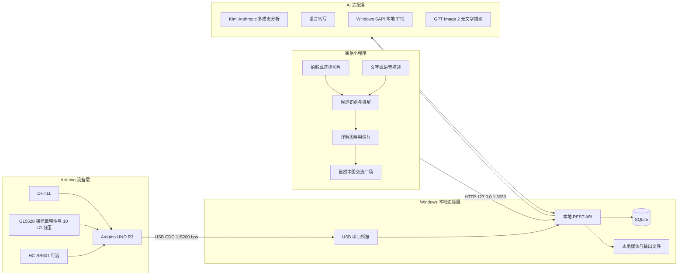
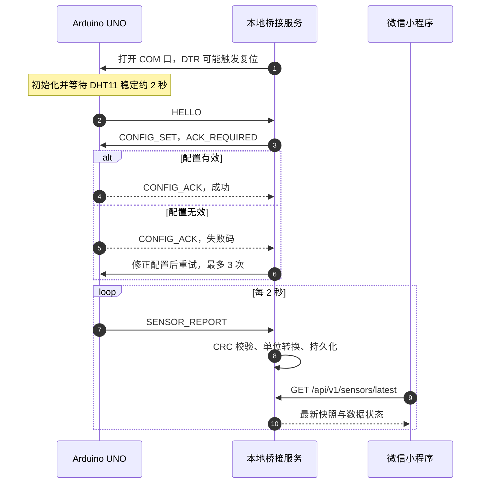
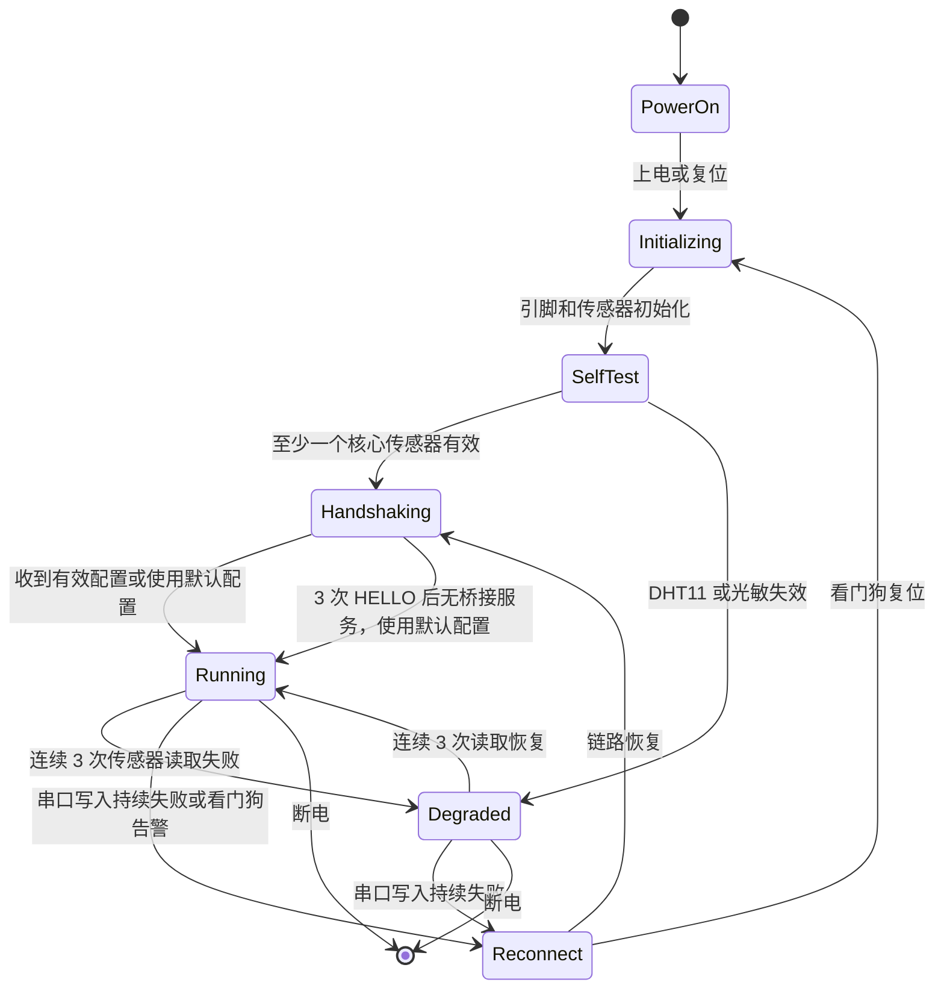
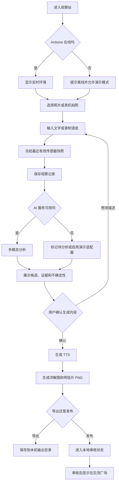

# 虫宿博物志产品需求文档（PRD）

> 副标题：AI 驱动的城乡青少年本土昆虫观察与交流平台
>
> 文档版本：v0.3
>
> 状态：MVP 基线
>
> 目标演示环境：Windows + 微信开发者工具模拟器 + USB 连接的 Arduino UNO R3

## 1. 文档目的

本文定义“虫宿博物志”MVP 的产品范围、功能优先级、软硬件接口、数据结构、异常处理和验收标准。开发、联调、演示和后续 PPT 均以本文为边界。

项目的一句话定义：

> 一套融合昆虫旅馆微气候数据、手机照片和儿童语音描述，由多模态 AI 生成辅助识别、语音讲解、博物详解图和自然明信片，并支持城乡学校交流的智能博物教育平台。

## 2. 背景、目标与成功标准

### 2.1 背景

活动主题为“好奇自然·智能昆虫旅馆”。可用主控为 Arduino UNO，未提供固定摄像头和昆虫旅馆制作材料。目标场景包含农机站、山家美育村、西海湿地、城市学校及未来乡村学校。

本产品将昆虫旅馆定义为“固定自然观察站”。Arduino 负责采集微气候，儿童通过小程序主动拍照或口述观察，AI 负责整理证据、生成候选识别和课程内容。MVP 不依赖现场制作昆虫旅馆。

### 2.2 产品目标

1. 在微信开发者工具中运行真实小程序项目，而非普通网页仿制界面。
2. 从 USB 连接的 Arduino UNO 持续读取真实环境数据。
3. 支持上传昆虫照片和输入观察描述，并保留语音描述扩展能力。
4. 使用多模态 AI 输出候选物种、判断依据、不确定性和继续观察建议。
5. 生成可导出的自然明信片 PNG 和博物详解图 PNG。
6. 将明信片发布到本地“自然中国”交流平台，支持按地区和学校浏览。
7. 多模态分析使用 Kimi 的 Anthropic Messages 兼容格式；无文字插画使用 GPT Image 2 兼容格式。
8. TTS 在当前 Windows 演示机上使用无需密钥的本地语音，外部 AI 服务不可用时仍能使用演示模式完成端到端流程。

### 2.3 MVP 成功标准

- Arduino 连续运行 30 分钟，串口有效帧率不低于 98%。
- 小程序在 5 秒内显示最新环境数据，并明确显示实时、陈旧或模拟状态。
- 用户可在 2 分钟内完成一次“选择照片、补充描述、AI 分析、播放讲解、生成明信片、发布交流广场”的完整演示。
- AI 结果始终使用“候选”“可能”“待核验”等辅助识别表达，不呈现为权威鉴定。
- 明信片和详解图中文字清晰，无模型生成的乱码文字。
- 关闭外网或 AI 服务报错时，已采集的观察记录不丢失，并可切换到明确标注的演示模式。

## 3. 用户角色与用户场景

### 3.1 用户角色

| 角色 | 主要目标 | MVP 权限 |
| --- | --- | --- |
| 学生观察者 | 记录身边昆虫并获得易懂讲解 | 新建观察、上传照片、填写描述、播放讲解、生成明信片 |
| 教师组织者 | 组织课程、比较不同地区记录 | 查看全部站点、浏览交流广场、查看教师版解释 |
| 演示操作员 | 保证 Arduino、AI 和小程序联调稳定 | 选择串口、查看设备状态、切换实时或演示模式 |
| 交流浏览者 | 认识不同地区的自然观察 | 浏览已发布明信片和地区筛选结果 |

### 3.2 核心用户场景

#### 场景 A：学生完成一次自然观察

学生在昆虫旅馆或校园绿地旁打开小程序，查看当前温湿度和光照，拍摄或选择昆虫照片，口述或输入外形与行为。系统冻结当前环境快照，AI 输出候选物种和判断依据。学生确认内容后生成明信片。

#### 场景 B：教师开展城乡对照课程

教师选择北京山地、湿地、农田和乡村学校的观察记录，比较昆虫出现时的环境差异。AI 根据数据生成一个可验证的问题，但不直接替学生下结论。

#### 场景 C：现场演示

操作员将 Arduino 插入电脑，启动本地桥接服务并在小程序中连接设备。模拟器从本地选择一张预备昆虫照片，调用真实 AI 或演示适配器，生成并导出两种图片，然后发布到本地交流广场。

#### 场景 D：设备或网络异常

串口断开时，小程序保留最近一次数据并标注“数据已陈旧”。AI 服务不可用时，观察记录进入“待分析”，用户可重试或使用明确标注的演示结果继续展示。

## 4. 系统边界

### 4.1 产品必须负责

- Arduino 传感器采集、基础自检和串口上报。
- Windows 本地桥接服务读取串口、校验协议、持久化数据并向小程序提供 REST API。
- 小程序端的站点状态、图片选择、文字描述、结果展示、TTS 播放、图片预览和交流广场。
- AI 服务适配层，统一处理图像、文字、语音转写、候选识别和内容生成。
- 明信片与详解图模板渲染，AI 只提供结构化内容和可选无文字插画。
- 本地 SQLite 数据库及本地文件存储。
- 实时模式、离线模式和演示模式的显著状态标识。
- 最小隐私保护：不公开儿童姓名、精确定位、面部照片或原始语音。

### 4.2 产品明确不做

- 不制作昆虫旅馆木质结构，不负责木工、竹筒或户外安装施工。
- 不使用固定摄像头进行 24 小时自动监控。
- 不把 HC-SR501 热释电传感器用于检测或统计昆虫。
- 不承诺准确识别到物种级，不提供检疫、医疗、毒性或食用安全结论。
- 不自动控制真实昆虫旅馆内的风扇、加热器、喷水或诱虫灯。
- MVP 不接入 Wi-Fi、BLE、4G、LTE-M、NB-IoT 或 LoRa 模块。
- MVP 不部署生产级公网服务器，不进行微信正式发布、审核、支付或真实账号体系开发。
- MVP 不实现开放式儿童社交、私聊、关注关系或未经教师审核的评论。
- AI 不生成带有不可核验中文文字的整张科普图；文字由固定模板排版。
- 演示数据必须标注“演示数据”，不得冒充真实长期观测数据。

### 4.3 未来扩展边界

- 低功耗微距摄像模块，仅用于获得授权后的固定观察站。
- ESP32、Wi-Fi、BLE 或蜂窝网络远程站点。
- 公网交流平台、学校账号、教师审核和真实跨校协作。
- 专家复核、权威物种数据库和公民科学数据接口。
- AI 无文字博物插画生成。

## 5. 功能清单与优先级

### 5.1 Must

| 编号 | 功能 | 描述 | 验收标准 |
| --- | --- | --- | --- |
| M-01 | 串口设备发现与连接 | 本地服务列出串口并连接 Arduino | 能列出 COM 口；连接成功后 5 秒内收到有效数据 |
| M-02 | 环境实时数据 | 显示温度、湿度、光照原始值及数据时间 | 每 2 秒刷新；超过 6 秒标记陈旧；超过 15 秒标记离线 |
| M-03 | 设备状态 | 显示固件版本、CRC 错误、传感器有效位和运行状态 | 状态与协议字段一致；错误不得伪装为正常数值 |
| M-04 | 新建观察 | 冻结照片采集时刻最近的传感器快照 | 观察记录保存后快照不可被后续实时数据覆盖 |
| M-05 | 图片输入 | 模拟器选择本地图片；真机接口保留拍照入口 | 支持 JPG/PNG，单图不超过 10 MB；上传后可预览 |
| M-06 | 文字描述 | 输入颜色、大小、行为、发现位置等信息 | 描述可为空；有描述时随 AI 请求提交 |
| M-07 | AI 辅助识别 | 输出最多 3 个候选及证据、不确定性、验证建议 | 结果不使用“确定识别”；失败后记录保持为待分析 |
| M-08 | 儿童版和教师版讲解 | 同一结果提供两种表述层级 | 页面可切换；教师版包含不确定性与观察方法 |
| M-09 | TTS 语音讲解 | 使用 Windows SAPI 将儿童版讲解生成 WAV 并播放 | 无需密钥；可播放、暂停和重播；失败时保留文字并提示原因 |
| M-10 | 博物详解图 | 生成 1080×1920 PNG | 原图、候选名称、证据、环境数据和免责声明完整可读 |
| M-11 | 自然明信片 | 生成 1600×1000 PNG | 生成时间不超过 5 秒；可预览并在电脑输出目录找到文件 |
| M-12 | 交流广场 | 发布并浏览明信片 | 发布后刷新可见；本地服务重启后数据仍存在 |
| M-13 | 地区与场景标签 | 记录地区、学校别名及山地/湿地/农田/校园场景 | 可按地区或场景筛选，不公开精确经纬度 |
| M-14 | 演示模式 | 无 Arduino 或无 AI 时走预置流程 | 状态栏持续显示“演示模式”；不混入真实统计 |
| M-15 | GPT Image 2 博物插画 | 按 OpenAI Images API 兼容格式生成无文字插画 | 保存为 PNG、标注 AI 示意图且不参与识别；失败时回退原始照片 |

### 5.2 Should

| 编号 | 功能 | 描述 | 验收标准 |
| --- | --- | --- | --- |
| S-01 | 语音描述与 ASR | 录制儿童口述并转成可编辑文字 | 录音成功后可回放；转写失败可手动输入 |
| S-02 | 人员靠近提示 | HC-SR501 仅用于检测观察者靠近或唤醒页面 | 页面显示“有人靠近观察站”，不计作昆虫事件 |
| S-03 | AI 课程问题 | 根据两地观察生成对照问题 | 问题包含可比较变量，不直接给出未经验证结论 |
| S-04 | 观察地图 | 按省市或场景展示明信片分布 | 地图点位使用模糊位置或站点位置 |
| S-05 | 任务重试 | 对 AI、TTS 和图片生成任务进行幂等重试 | 同一幂等键不会生成重复观察或重复帖子 |
| S-06 | 串口自动重连 | COM 口短暂断开后自动恢复 | 重新插入原设备后 15 秒内恢复数据 |
| S-07 | 内容审核状态 | 发布前默认进入本地审核流程 | 未审核内容仅本机可见；审核后进入广场 |

### 5.3 Could

| 编号 | 功能 | 描述 |
| --- | --- | --- |
| C-01 | 插画风格切换 | 在博物铜版画、儿童手账和自然水彩之间切换，均不生成文字 |
| C-02 | 明信片模板切换 | 博物版、儿童手账版、山水邮票版 |
| C-03 | 评论与点赞 | 仅限预置身份和教师审核的演示交互 |
| C-04 | 全国自然年鉴 | 按月份、地区和场景汇总观察记录 |
| C-05 | MQTT 远程站点 | ESP32 版本通过 MQTT 上传数据 |
| C-06 | 风扇与马达实验 | 在空舱中进行通风、遮光或风场实验，不作用于真实入住昆虫 |

## 6. 系统架构



## 7. 硬件清单（BOM）

### 7.1 MVP BOM

| 类别 | 型号或规格 | 数量 | 优先级 | 电气说明 | 用途 |
| --- | --- | ---: | --- | --- | --- |
| 主控板 | Arduino UNO R3，ATmega328P-AU，16 MHz | 1 | Must，已确认 | 5 V 逻辑，USB 供电 | 采集和协议封装 |
| 温湿度 | DHT11（三针模块或四针裸器件） | 1 | Must，已确认 | VCC 3.3–5 V；裸器件 DATA 需外接 10 kΩ 上拉 | 温湿度采集 |
| 光照 | GL5528 裸光敏电阻或同规格光敏电阻 | 1 | Must，已确认使用裸器件 | 与 10 kΩ 电阻组成 5 V 分压 | 相对光照采集，不作为照度计 |
| 人体感应 | HC-SR501 | 1 | Should | VCC 5 V，OUT 高电平约 3.3 V | 检测人员靠近，不检测昆虫 |
| 状态灯 | UNO 板载 LED | 1 | Must | D13 板载 | 心跳和错误提示 |
| 连接线 | USB Type-B 数据线 | 1 | Must | 同时供电和通信 | 连接电脑 |
| 面包板与杜邦线 | 常规规格 | 1 套 | Must | 注意公共地 | 连接模块 |
| 上拉电阻 | 10 kΩ | 1 | 条件 Must | 裸 DHT11 必须；三针模块通常自带 | DHT 数据线上拉 |
| 分压电阻 | 10 kΩ，1/4 W，±5% 或更好 | 1 | Must | A0 到 GND | 与裸光敏电阻形成分压 |
| 演示电脑 | Windows 10/11 x64 | 1 | Must | 可运行微信开发者工具和 Node.js | 边缘网关与小程序模拟器 |

### 7.2 通信模块选择

| 模块 | MVP 是否使用 | 决策 |
| --- | --- | --- |
| USB CDC 串口 | 是 | Arduino 通过板载 ATmega16U2 或 CH340G 与电脑通信 |
| Wi-Fi | 否 | 电脑已作为边缘网关，MVP 不增加 ESP8266/ESP32 |
| BLE | 否 | 模拟器演示不需要，避免配对和权限风险 |
| 4G/LTE-M/NB-IoT | 否 | 成本和运营复杂度不符合活动原型范围 |
| MQTT | 否 | V1 使用本地 REST；仅保留远程站点扩展定义 |

### 7.3 可用但不纳入 MVP 的执行器

| 器件 | 使用条件 | 安全约束 |
| --- | --- | --- |
| 5 V 直流风扇 | Could，用于空舱通风实验或展台效果 | 必须使用三极管或 MOSFET 驱动、续流二极管和独立 5 V 电源；禁止直接接 GPIO |
| 直流马达或转子 | Could，用于纸质转盘或风场实验 | 必须使用电机驱动模块；电机电源与 UNO 共地；禁止作用于真实昆虫栖息舱 |

## 8. 原理与接线表

### 8.1 MVP 引脚分配

| Arduino UNO 引脚 | 连接器件 | 器件引脚 | UNO 侧电平 | 方向 | 备注 |
| --- | --- | --- | --- | --- | --- |
| 5V | DHT11 | VCC | 5 V | 电源输出 | 裸传感器 DATA 到 5V 需 10 kΩ 上拉 |
| GND | DHT11 | GND | 0 V | 电源 | 公共地 |
| D2 | DHT11 | DATA | 5 V 数字 | 双向单总线 | 不与 UART 共用 |
| 5V | 裸光敏电阻 | 一端 | 5 V | 分压输入 | 另一端接 A0；无正负极 |
| A0 | 裸光敏电阻与 10 kΩ 电阻 | 分压中点 | 0–5 V 模拟 | 输入 | ADC 10 位，范围 0–1023 |
| GND | 10 kΩ 分压电阻 | 一端 | 0 V | 分压参考 | 电阻另一端接 A0；此接法下越亮原始值越高 |
| 5V | HC-SR501 | VCC | 5 V | 电源输出 | Should 功能 |
| GND | HC-SR501 | GND | 0 V | 电源 | 公共地 |
| D3 | HC-SR501 | OUT | 高电平约 3.3 V | 输入 | UNO 可识别；仅检测人员靠近 |
| D13 | 板载 LED | LED_BUILTIN | 5 V 数字 | 输出 | 慢闪正常，快闪异常 |
| D0/RX | USB 串口 | 板载桥接芯片 | 5 V TTL 内部 | 输入 | 保留，禁止外接其他模块 |
| D1/TX | USB 串口 | 板载桥接芯片 | 5 V TTL 内部 | 输出 | 保留，禁止外接其他模块 |

DHT11 若为四针裸器件，按传感器正面栅格朝向自己时，从左到右通常为 `VCC、DATA、NC、GND`，`NC` 不接；接线前仍须以实物丝印或购买页数据手册为准。若为三针模块，则直接按模块 `+ / OUT(S) / -` 丝印连接，通常无需再加外部上拉电阻。

### 8.2 预留引脚

| 引脚 | 预留用途 |
| --- | --- |
| A4/SDA、A5/SCL | 未来 I2C 屏幕或数字光照传感器 |
| D5/PWM | 未来风扇驱动使能，不得直连风扇 |
| D6/PWM | 未来电机驱动使能 |
| D7、D8 | 未来电机驱动方向控制 |
| D10–D12 | 未来 SPI 外设；D13 已用于状态灯 |

### 8.3 电源与安全约束

- MVP 传感器由 UNO 的 5V 引脚供电，UNO 由电脑 USB 供电。
- 所有模块必须共地。
- A0 输入不得超过 5 V，不得接负电压。
- 风扇和马达不得直接连接 Arduino GPIO 或 5V 引脚。
- 接线或更换模块前必须断开 USB。
- 裸光敏电阻只输出相对光照。未校准前，产品不得显示“lux”。固定接法为 `5V → 光敏电阻 → A0 → 10 kΩ → GND`，因此环境越亮，A0 原始值通常越高。

## 9. 设备通信协议

### 9.1 物理层和 UART 参数

| 参数 | 值 |
| --- | --- |
| 物理连接 | Arduino USB CDC 串口 |
| UART 波特率 | 115200 bps |
| 数据位 | 8 |
| 校验位 | None |
| 停止位 | 1 |
| 流控 | None |
| UART 字节顺序 | LSB first，由硬件 UART 决定 |
| 多字节字段 | Little-endian |
| 最大 payload | 128 字节 |
| 默认采样周期 | 2000 ms，符合 DHT11 采样限制 |
| 默认上报周期 | 2000 ms |

MVP 不使用 I2C 和 SPI 外设。若未来接入 I2C 屏幕，UNO 使用 7 位地址和 100 kHz 标准模式，地址由器件型号另行分配，不得在本版中臆造。

### 9.2 二进制帧格式

| 偏移 | 长度 | 字段 | 类型 | 说明 |
| ---: | ---: | --- | --- | --- |
| 0 | 1 | PREAMBLE_0 | u8 | 固定 `0xAA` |
| 1 | 1 | PREAMBLE_1 | u8 | 固定 `0x55` |
| 2 | 1 | VERSION | u8 | 当前 `0x01` |
| 3 | 1 | MSG_TYPE | u8 | 消息类型 |
| 4 | 1 | FLAGS | u8 | bit0 需 ACK；bit1 为 ACK；bit2 为错误 |
| 5 | 1 | RESERVED | u8 | 固定为 0，接收端忽略非零值并记录 |
| 6 | 2 | SEQ | u16 LE | 发送方递增序号，溢出后归零 |
| 8 | 2 | PAYLOAD_LEN | u16 LE | 0–128 |
| 10 | N | PAYLOAD | bytes | 消息载荷 |
| 10+N | 2 | CRC16 | u16 LE | CRC-16/CCITT-FALSE |

CRC 参数：多项式 `0x1021`，初值 `0xFFFF`，不反射，最终异或 `0x0000`。CRC 覆盖从 VERSION 到 PAYLOAD 最后一个字节，不包含两个帧头字节和 CRC 本身。

接收端遇到非法长度、版本不支持或 CRC 错误时丢弃当前帧，并重新搜索 `0xAA 0x55`。遥测帧不重发，配置命令需要 ACK。

### 9.3 消息类型

| MSG_TYPE | 名称 | 方向 | 是否 ACK | 说明 |
| --- | --- | --- | --- | --- |
| `0x01` | HELLO | 设备到桥接服务 | 否 | 开机声明身份、版本和能力 |
| `0x02` | SENSOR_REPORT | 设备到桥接服务 | 否 | 周期传感器上报 |
| `0x03` | EVENT_REPORT | 设备到桥接服务 | 否 | 可选人员靠近事件 |
| `0x10` | CONFIG_SET | 桥接服务到设备 | 是 | 设置采样和上报周期 |
| `0x11` | CONFIG_ACK | 设备到桥接服务 | 否 | 配置结果 |
| `0x12` | PING | 双向 | 是 | 链路探测 |
| `0x13` | PONG | 双向 | 否 | PING 响应 |
| `0x7F` | ERROR | 双向 | 否 | 协议级错误描述 |

### 9.4 SENSOR_REPORT payload 字节布局

payload 固定 16 字节。

| 偏移 | 长度 | 字段 | 类型 | 单位与取值 |
| ---: | ---: | --- | --- | --- |
| 0 | 4 | uptimeMs | u32 LE | 设备启动后毫秒数 |
| 4 | 2 | temperatureDeciC | i16 LE | 0.1℃；`253` 表示 25.3℃ |
| 6 | 2 | humidityDeciPct | u16 LE | 0.1%RH；`615` 表示 61.5%RH |
| 8 | 2 | lightRaw | u16 LE | UNO ADC 原始值 0–1023 |
| 10 | 1 | pirState | u8 | 0 无人、1 有人、`0xFF` 无效或未启用 |
| 11 | 2 | sensorStatus | u16 LE | 传感器和设备状态位 |
| 13 | 1 | deviceState | u8 | 0 初始化、1 正常、2 降级、3 故障 |
| 14 | 2 | sampleCounter | u16 LE | 采样计数器，溢出后归零 |

无效值约定：温度使用 `-32768`，湿度和光照使用 `0xFFFF`，PIR 使用 `0xFF`。应用必须优先读取 sensorStatus，不得把无效值显示成真实数据。

sensorStatus 位定义：

| 位 | 名称 | 1 的含义 |
| ---: | --- | --- |
| 0 | DHT_VALID | 温湿度有效 |
| 1 | LIGHT_VALID | 光照原始值有效 |
| 2 | PIR_VALID | PIR 已启用且输入有效 |
| 3 | CONFIG_VALID | 已应用桥接服务配置 |
| 4 | SERIAL_OVERFLOW | 本次启动曾发生串口缓冲溢出 |
| 5 | WATCHDOG_RESET | 本次启动原因为看门狗复位 |
| 6–15 | RESERVED | 保留，发送为 0 |

### 9.5 CONFIG_SET payload

payload 固定 6 字节。

| 偏移 | 长度 | 字段 | 类型 | 说明 |
| ---: | ---: | --- | --- | --- |
| 0 | 2 | sampleIntervalMs | u16 LE | 2000–60000 ms |
| 2 | 2 | reportIntervalMs | u16 LE | 2000–60000 ms，且不小于采样周期 |
| 4 | 1 | pirEnabled | u8 | 0 关闭、1 开启 |
| 5 | 1 | reserved | u8 | 固定 0 |

### 9.6 握手与周期上报时序



### 9.7 超时和重试

- 桥接服务打开串口后等待 3 秒接收 HELLO；未收到则发送一次 PING。
- CONFIG_SET 的 ACK 超时为 1000 ms，最多重试 3 次，SEQ 保持不变。
- SENSOR_REPORT 不要求 ACK，不进行设备端重传。
- 连续 6 秒无有效遥测时状态为 stale；连续 15 秒无有效帧时状态为 offline。
- 自动重连退避为 1 秒、2 秒、5 秒，此后每 10 秒重试一次。
- 单次 CRC 错误仅丢帧；10 秒内 CRC 错误率超过 10% 时显示链路告警。
- 小程序 REST 请求超时 3 秒，可重试 2 次；AI 请求超时 45 秒，使用相同幂等键自动重试 1 次。

## 10. 状态机与业务流程

### 10.1 设备状态机



### 10.2 观察与明信片业务流程



### 10.3 异常与降级策略

| 异常 | 判定 | 系统行为 | 用户提示 |
| --- | --- | --- | --- |
| DHT11 临时失败 | 单次读取失败 | 保留上次值但标记 stale，不上报为新有效值 | 温湿度暂不可用 |
| DHT11 持续失败 | 连续 3 次失败 | 温湿度写入无效哨兵值，设备进入 Degraded | 传感器异常，其他数据继续工作 |
| 光敏开路或短路疑似 | 原始值连续 10 秒接近 0 或 1023 | 标记 LIGHT_VALID=0，仍上报其他字段 | 光照传感器需检查 |
| PIR 长时间高电平 | 连续高电平超过 60 秒 | 标记可疑但不影响核心流程 | 人员感应可能受遮挡或延时设置影响 |
| 串口断开 | 15 秒无有效帧或端口消失 | 自动重连，保留最近快照 | Arduino 已断开，数据已陈旧 |
| 外网断开 | AI 请求网络失败 | 保存观察，进入待分析；允许演示适配器 | 观察已保存，AI 稍后重试 |
| AI 返回非结构化内容 | JSON 校验失败 | 自动修复请求一次，仍失败则进入待人工处理 | AI 结果暂不可用 |
| TTS 失败 | 20 秒无结果或格式错误 | 保留文字，不阻断图片生成 | 语音生成失败，可阅读文字 |
| 图片生成失败 | 模板渲染异常 | 保留观察和 AI 结果，允许重试 | 明信片生成失败，记录未丢失 |
| 小程序关闭 | 任务未完成 | 任务由后端继续，重新打开后查询状态 | 显示进行中或已完成 |

## 11. 数据结构定义

### 11.1 统一单位与时间

- 固件传输温度使用 0.1℃ 的有符号整数；REST 和数据库使用 `temperatureC` 浮点数。
- 固件传输湿度使用 0.1%RH 的无符号整数；REST 和数据库使用 `humidityPct` 浮点数。
- 裸光敏电阻分压电路未校准，只保存 `lightRaw` 0–1023 和校准后的相对百分比，不使用 lux。
- 固件只提供 `uptimeMs`。绝对时间由桥接服务收到有效帧时生成。
- API 时间统一使用带时区的 ISO 8601，例如 `2026-09-09T17:26:00+08:00`。
- 串口多字节字段使用 little-endian；网络 JSON 不涉及大小端。

### 11.2 SensorSnapshot

```json
{
  "stationId": "BJ-MTG-SJMZ-01",
  "deviceId": "UNO00001",
  "capturedAt": "2026-09-09T17:26:00+08:00",
  "receivedAt": "2026-09-09T17:26:00.084+08:00",
  "uptimeMs": 183420,
  "temperatureC": 25.3,
  "humidityPct": 61.5,
  "lightRaw": 436,
  "lightRelativePct": 42.6,
  "humanPresence": false,
  "statusFlags": 15,
  "deviceState": "running",
  "source": "live",
  "dataAgeMs": 84
}
```

`source` 只能为 `live`、`stale` 或 `demo`。前端必须以不同颜色和文字区分。

### 11.3 Observation

```json
{
  "id": "018f2f2b-7c5e-7b23-a5ef-19eeb3e0e011",
  "stationId": "BJ-MTG-SJMZ-01",
  "schoolAlias": "王平中学自然观察组",
  "regionCode": "110109",
  "locationLabel": "九龙山脚下自然课堂",
  "habitat": "mountain_forest_edge",
  "capturedAt": "2026-09-09T17:26:00+08:00",
  "imagePath": "/data/uploads/observations/018f2f2b/image.jpg",
  "audioPath": null,
  "transcript": null,
  "userDescription": "黄黑相间，停在花上，有透明翅膀。",
  "sensorSnapshot": {},
  "aiStatus": "pending",
  "verificationStatus": "unverified",
  "visibility": "local",
  "createdAt": "2026-09-09T17:26:04+08:00"
}
```

### 11.4 AIAnalysis

```json
{
  "observationId": "018f2f2b-7c5e-7b23-a5ef-19eeb3e0e011",
  "modelProvider": "kimi-anthropic",
  "modelName": "configured-kimi-vision-model",
  "promptVersion": "insect-analysis-v1",
  "candidates": [
    {
      "commonName": "食蚜蝇类",
      "scientificName": null,
      "confidence": 0.72,
      "evidence": ["黄黑相间", "访花行为", "可见一对主要翅膀"],
      "counterEvidence": ["照片未清楚显示触角"],
      "verifyNext": ["补拍翅膀侧面", "观察触角长度"]
    }
  ],
  "childExplanation": "这位访花客可能属于食蚜蝇类……",
  "teacherExplanation": "当前结论为候选识别，仍缺少触角和翅脉证据……",
  "safetyNotice": "请保持距离观察，不要徒手捕捉未知昆虫。",
  "ttsText": "这位访花客可能属于食蚜蝇类……",
  "generatedAt": "2026-09-09T17:26:22+08:00"
}
```

`confidence` 仅表示模型内部候选排序，不得展示成科学鉴定准确率。

### 11.5 Artifact

```json
{
  "id": "art_018f2f2b_postcard",
  "observationId": "018f2f2b-7c5e-7b23-a5ef-19eeb3e0e011",
  "type": "postcard",
  "templateVersion": "museum-postcard-v1",
  "format": "png",
  "width": 1600,
  "height": 1000,
  "filePath": "/data/artifacts/art_018f2f2b_postcard.png",
  "sha256": "generated-at-runtime",
  "createdAt": "2026-09-09T17:26:27+08:00"
}
```

详解图固定为 1080×1920 PNG；明信片固定为 1600×1000 PNG。

### 11.6 FeedPost

```json
{
  "id": "post_018f2f2b",
  "observationId": "018f2f2b-7c5e-7b23-a5ef-19eeb3e0e011",
  "artifactId": "art_018f2f2b_postcard",
  "schoolAlias": "王平中学自然观察组",
  "regionCode": "110109",
  "regionLabel": "北京·门头沟",
  "habitat": "mountain_forest_edge",
  "message": "来自九龙山脚下的自然来信",
  "moderationStatus": "approved",
  "dataSource": "live",
  "publishedAt": "2026-09-09T17:27:00+08:00"
}
```

## 12. 开发环境

### 12.1 固件

| 项目 | 基线 |
| --- | --- |
| 目标平台 | Arduino UNO R3 / ATmega328P |
| 架构 | AVR 8 位 |
| 运行方式 | 裸机主循环，不使用 RTOS |
| Arduino CLI | 1.5.1，实施前安装 |
| Arduino AVR Boards Core | 1.8.8 |
| 编译目标 FQBN | `arduino:avr:uno` |
| 语言 | Arduino C/C++ |
| 串口库 | Arduino HardwareSerial |
| 看门狗 | AVR WDT，目标 8 秒，可在调试构建关闭 |

Arduino CLI 1.5.1 和 AVR Core 1.8.8 为本文编写时的稳定基线。依赖安装完成后必须将实际版本写入 README 和构建日志。

### 12.2 本地桥接与服务端

| 项目 | 基线 |
| --- | --- |
| 操作系统 | Windows 10/11 x64 |
| Node.js | 24.13.0，当前机器已检测 |
| 包管理器 | pnpm 11.19.0，当前工作区运行时已检测 |
| 语言 | JavaScript ES Modules；MVP 不强制 TypeScript |
| 串口库 | `serialport`，版本锁定在 `pnpm-lock.yaml` |
| HTTP 框架 | Express 或 Fastify，实施时二选一并锁定 |
| 数据库 | SQLite 3 |
| 图片模板渲染 | `sharp` 或等价服务端图像合成库 |
| 默认监听地址 | `127.0.0.1:3050` |

当前系统全局 npm 配置不可用，实施必须使用工作区提供的 pnpm，不依赖全局 npm。

### 12.3 小程序

| 项目 | 基线 |
| --- | --- |
| 平台 | 微信原生小程序 WXML/WXSS/JavaScript |
| 微信开发者工具 | 2.02.0，当前机器已检测 |
| 运行目标 | Windows 开发者工具模拟器 |
| AppID | 使用微信开发者工具测试号，不申请正式发布 |
| 网络设置 | 开发阶段允许不校验合法域名，访问 `127.0.0.1:3050` |
| 图片输入 | 模拟器使用本地文件选择；真机保留 `wx.chooseMedia` 拍照能力 |
| 录音 | `wx.getRecorderManager`，必须提供文字输入降级 |
| 音频播放 | `wx.createInnerAudioContext` |
| 画布 | Canvas 2D 仅用于预览；最终 PNG 由后端模板生成以保证一致性 |

### 12.4 AI、图片与 TTS 适配器

#### Kimi 多模态分析

按用户提供的 Anthropic Messages 兼容格式接入。已取得本地接口配置，但密钥不得写入业务代码、PRD、日志或 Git；运行时通过环境变量注入：

```text
KIMI_ANTHROPIC_BASE_URL=https://api.kimi.com/coding
KIMI_ANTHROPIC_API_KEY=仅保存在本地环境中
KIMI_ANTHROPIC_MODEL=k3
KIMI_ANTHROPIC_AUTH_MODE=x-api-key
```

默认请求为 `POST {KIMI_ANTHROPIC_BASE_URL}/v1/messages`，使用 `x-api-key` 和 `anthropic-version: 2023-06-01` 请求头。若兼容服务要求 Bearer Token，可将 `KIMI_ANTHROPIC_AUTH_MODE` 改为 `bearer`。图片使用 Anthropic 内容块格式：

```json
{
  "model": "${KIMI_ANTHROPIC_MODEL}",
  "max_tokens": 1800,
  "system": "你是谨慎的儿童博物教育助手，只输出符合给定 JSON Schema 的数据。",
  "messages": [
    {
      "role": "user",
      "content": [
        {
          "type": "image",
          "source": {
            "type": "base64",
            "media_type": "image/jpeg",
            "data": "${BASE64_IMAGE_DATA}"
          }
        },
        {
          "type": "text",
          "text": "${OBSERVATION_CONTEXT_AND_SENSOR_SNAPSHOT}"
        }
      ]
    }
  ]
}
```

服务端必须将返回文本解析并校验为 AIAnalysis。Kimi 仅负责候选分析和文字内容，不直接生成最终中文海报。

#### GPT Image 2 兼容生图

使用用户提供的 OpenAI Images API 兼容网关和 `gpt-image-2` 模型。密钥仍只通过环境变量注入：

```text
IMAGE_API_BASE_URL=https://s.lconai.com
IMAGE_API_KEY=仅保存在本地环境中
IMAGE_MODEL=gpt-image-2
```

默认请求为 `POST {IMAGE_API_BASE_URL}/v1/images/generations`：

```json
{
  "model": "${IMAGE_MODEL}",
  "prompt": "生成无文字、科学插画风格的昆虫候选示意图；不得添加标签、标题或中文字符。",
  "size": "1024x1024",
  "quality": "medium",
  "n": 1,
  "response_format": "b64_json"
}
```

这份请求字段以用户提供的兼容脚本为准，其中返回格式字段为 `response_format`。适配器优先读取 `data[0].b64_json`，解码并保存 PNG；若兼容服务返回 URL，服务端下载并校验 MIME、尺寸和文件大小后再保存。网关还提供 `POST /v1/images/edits` 的 multipart 改图能力，V1 不依赖它，后续可用于风格化原始观察照片。

生图接入属于 Must，但生成结果不参与物种判断，并永久标注“AI 艺术化示意图”；接口失败时，明信片和详解图必须自动回退到原始照片。

#### 凭据管理

- `materials/private/apis/` 中的本地材料包含真实凭据，仅作为开发机配置来源，整个目录加入 `.gitignore`。
- 后端启动时将凭据读入进程环境；小程序端永远不得接触、保存或打印上游 API 密钥。
- 错误日志只记录服务名、HTTP 状态码、request ID 和脱敏后的错误摘要。
- 禁止把完整请求头、Base64 图片或密钥写入日志；对外演示前检查 Git 历史和控制台输出。

#### 无密钥 TTS

MVP 采用 Windows 本地 SAPI，无需 API 密钥和外网。当前演示机已检测到中文语音 `Microsoft Huihui`、`Microsoft Kangkang` 和 `Microsoft Yaoyao`，默认使用更适合儿童讲解的 `Microsoft Yaoyao`。

```text
TTS_PROVIDER=windows-sapi
TTS_VOICE=Microsoft Yaoyao
TTS_OUTPUT=wav-pcm-16k-mono
```

本地服务调用 Windows `System.Speech.Synthesis.SpeechSynthesizer`，输出 16 kHz、16 bit、单声道 PCM WAV，并按 `SHA-256(voice + rate + text)` 缓存。若默认声音不可用，依次回退到 `Microsoft Huihui` 和 `Microsoft Kangkang`。生产环境如需更自然的声音，再接入火山引擎、腾讯云或 Azure Speech 的正式 TTS 适配器；这些服务不属于 MVP，且需要单独密钥和费用评估。

## 13. 云端与 APP 接口

### 13.1 通用约定

- Base URL：`http://127.0.0.1:3050/api/v1`
- 内容类型：普通请求使用 `application/json`，媒体上传使用 `multipart/form-data`。
- 响应时间使用 ISO 8601。
- 写接口支持 `Idempotency-Key` 请求头。
- MVP 无真实账号鉴权，仅绑定本机演示会话；不得暴露到公网。

统一响应：

```json
{
  "success": true,
  "requestId": "req_018f2f2b",
  "data": {},
  "error": null
}
```

统一错误：

```json
{
  "success": false,
  "requestId": "req_018f2f2b",
  "data": null,
  "error": {
    "code": "SERIAL_DEVICE_OFFLINE",
    "message": "Arduino 已断开",
    "retryable": true
  }
}
```

### 13.2 串口与设备接口

| 方法 | 路径 | 用途 | 主要响应 |
| --- | --- | --- | --- |
| GET | `/health` | 服务健康检查 | 服务、数据库、AI 适配器状态 |
| GET | `/serial/ports` | 列出可用串口 | COM 口、VID/PID、制造商 |
| POST | `/serial/connect` | 连接指定串口 | 连接状态和设备 HELLO 信息 |
| DELETE | `/serial/connection` | 主动断开串口 | 204 |
| GET | `/device` | 当前设备状态 | 在线状态、固件、错误计数 |
| GET | `/sensors/latest` | 最新传感器快照 | SensorSnapshot |
| GET | `/sensors/history` | 查询历史数据 | 时间范围内快照列表 |

连接请求：

```json
{
  "port": "COM3",
  "baudRate": 115200
}
```

`/sensors/history` 参数：`stationId`、`from`、`to`、`limit`，MVP 最大返回 1000 条。

### 13.3 观察接口

| 方法 | 路径 | 用途 | 返回 |
| --- | --- | --- | --- |
| POST | `/observations` | 创建观察并上传图片、可选音频和元数据 | 201 + Observation |
| GET | `/observations/:id` | 查询观察和任务状态 | Observation + AIAnalysis 摘要 |
| PATCH | `/observations/:id` | 修改未发布描述和标签 | 更新后的 Observation |
| POST | `/observations/:id/transcribe` | 启动语音转写 | 202 + jobId |
| POST | `/observations/:id/analyze` | 启动多模态分析 | 202 + jobId |

`POST /observations` 为 multipart：

- `image`：必填，JPG/PNG，最大 10 MB。
- `audio`：可选，最大 60 秒、10 MB。
- `metadata`：JSON 字符串，包含 stationId、schoolAlias、regionCode、locationLabel、habitat、userDescription 和 sensorSnapshotId。

### 13.4 AI、TTS 与任务接口

| 方法 | 路径 | 用途 | 返回 |
| --- | --- | --- | --- |
| GET | `/jobs/:jobId` | 查询异步任务 | queued/running/succeeded/failed |
| GET | `/observations/:id/analysis` | 获取完整 AI 结果 | AIAnalysis |
| POST | `/observations/:id/tts` | 生成指定版本语音 | 202 + jobId |
| GET | `/audio/:artifactId` | 播放 TTS 文件 | MVP 为 audio/wav |
| POST | `/comparisons/questions` | 生成两地对照问题 | 课程问题列表 |

TTS 请求：

```json
{
  "provider": "windows-sapi",
  "voiceProfile": "Microsoft Yaoyao",
  "textSource": "childExplanation",
  "rate": 0
}
```

### 13.5 图片生成与导出接口

| 方法 | 路径 | 用途 | 返回 |
| --- | --- | --- | --- |
| POST | `/observations/:id/illustrations` | 调用 GPT Image 2 兼容接口生成无文字插画 | 202 + jobId |
| POST | `/observations/:id/artifacts` | 生成明信片或详解图 | 201 + Artifact |
| GET | `/artifacts/:id` | 获取文件元数据 | Artifact |
| GET | `/artifacts/:id/file` | 下载或预览 PNG | image/png |

生成请求：

```json
{
  "type": "postcard",
  "templateId": "museum-postcard-v1",
  "includeAiIllustration": false
}
```

### 13.6 交流平台接口

| 方法 | 路径 | 用途 | 返回 |
| --- | --- | --- | --- |
| POST | `/posts` | 发布明信片到本地交流广场 | 201 + FeedPost |
| GET | `/posts` | 分页浏览 | FeedPost 列表和 cursor |
| GET | `/posts/:id` | 查看帖子详情 | FeedPost、观察摘要和图片 |
| PATCH | `/posts/:id/moderation` | 本地教师审核 | 更新后的审核状态 |
| GET | `/stations` | 获取站点列表 | 模糊位置、地区、场景和统计 |

`GET /posts` 支持 `regionCode`、`habitat`、`schoolAlias`、`dataSource`、`cursor` 和 `limit`。默认只返回 `approved` 内容。

### 13.7 预留 MQTT 主题

MVP 不启用 MQTT。未来 ESP32 远程站点沿用以下命名：

```text
bugatlas/v1/stations/{stationId}/telemetry
bugatlas/v1/stations/{stationId}/events
bugatlas/v1/stations/{stationId}/status
bugatlas/v1/stations/{stationId}/commands/config
bugatlas/v1/stations/{stationId}/acks/config
```

- telemetry 使用 QoS 0，不 retained。
- commands/config 使用 QoS 1，可 retained。
- status 使用 QoS 1，遗嘱消息为 `offline`。
- payload 使用 JSON，字段单位与 REST SensorSnapshot 一致。

## 14. AI 输出契约与安全边界

### 14.1 AI 输入

- 一张昆虫或自然观察照片。
- 用户文字描述或 ASR 转写。
- 环境快照，包括温度、湿度、相对光照、时间和场景。
- 模糊地区和站点标签。

### 14.2 AI 必须输出

- 0–3 个候选分类；证据不足时允许返回空列表。
- 每个候选的支持证据、反证和下一步验证建议。
- 儿童版解释、教师版解释和安全提示。
- 用于 TTS 的纯文本。
- 用于明信片的短文，长度不超过 140 个中文字符。

### 14.3 AI 禁止输出

- “已确定为”“百分之百”“可安全触摸或食用”等无依据断言。
- 根据照片推断儿童身份、年龄、学校真实名称或精确位置。
- 鼓励捕捉、伤害、喂食或干扰未知昆虫。
- 伪造拉丁学名、保护等级或政策事实。
- 把 PIR 数据解释为昆虫活动。

### 14.4 结果校验

- 服务端使用 JSON Schema 校验 AI 输出。
- 候选 confidence 必须在 0–1，且仅用于排序。
- 无法解析时自动进行一次结构修复；仍失败则转入人工处理。
- 所有输出页面显示“AI 辅助分析，仅供自然教育；请结合持续观察或专家资料核验”。

## 15. 页面结构

| 页面 | Must 内容 | Should 内容 |
| --- | --- | --- |
| 观察站首页 | 设备连接、实时环境、数据来源状态、新建观察 | PIR 人员靠近提示、历史小趋势 |
| 发现昆虫 | 图片选择、文字描述、地点和场景 | 录音、ASR、拍摄指导轮廓 |
| AI 博物导师 | 候选列表、证据、不确定性、继续观察建议 | 儿童版/教师版切换、对比卡 |
| 明信片工坊 | 两种 PNG 生成、GPT Image 2 无文字插画、预览和导出 | 模板与插画风格切换 |
| 自然中国 | 交流广场、地区和场景筛选、发布 | 地图、城乡对照问题、自然年鉴 |
| 演示设置 | 串口选择、实时/演示模式、AI 适配器状态 | 协议日志、错误计数、重试按钮 |

## 16. 非功能需求

### 16.1 性能

- 本地传感器接口 P95 响应不超过 300 ms。
- 小程序首页显示最新数据不超过 5 秒。
- 模板图片生成不超过 5 秒。
- AI 分析目标不超过 30 秒，硬超时 45 秒。
- GPT Image 2 插画生成目标不超过 90 秒，硬超时 120 秒；相同输入和风格优先命中缓存。
- TTS 目标不超过 10 秒，硬超时 20 秒。

### 16.2 稳定性

- 桥接服务连续运行 2 小时不崩溃。
- SQLite 写入使用事务，观察记录与媒体元数据保持一致。
- AI 和 TTS 失败不得导致原始照片、描述和传感器快照丢失。
- 演示模式不依赖外网和 Arduino。

### 16.3 隐私与内容安全

- 上传界面提示只拍昆虫和环境，避免拍摄儿童正脸。
- 公开交流平台不保存儿童真实姓名和精确经纬度。
- 原始语音默认仅本地保存，可配置转写成功后删除。
- AI 密钥只能放在本地服务环境变量中，不得写入小程序代码或 Git。
- 发布前默认进入审核状态。

### 16.4 可观察性

- 本地服务日志包含 requestId、deviceId、任务耗时和错误码，但不打印密钥或完整儿童语音文本。
- 提供 `/health` 和设备状态页。
- 协议统计至少包含有效帧数、CRC 错误数、丢序号数和最后有效帧时间。

## 17. 总体验收清单

### 17.1 硬件与协议

- [ ] UNO 上电后 3 秒内发出 HELLO。
- [ ] 本地服务能以固定 115200 bps 连接并读取 SENSOR_REPORT。
- [ ] 拔掉 DHT11 后系统显示无效，不显示异常极值。
- [ ] 拔掉 USB 后 15 秒内显示离线，重新插入后可恢复。
- [ ] 人员走近时 PIR 可触发提示，页面明确其含义为“人员靠近”。
- [ ] CRC 错误帧被丢弃并计入统计。

### 17.2 小程序与 AI

- [ ] 微信开发者工具可打开并运行项目。
- [ ] 模拟器可以从本地选择 JPG/PNG 并预览。
- [ ] 新观察绑定创建时刻最近的有效传感器快照。
- [ ] AI 返回最多 3 个候选和可核验的判断依据。
- [ ] AI 服务失败时观察记录不丢失。
- [ ] 儿童版讲解可通过 TTS 播放。
- [ ] GPT Image 2 兼容接口能生成并保存无文字 PNG，页面显示“AI 艺术化示意图”。
- [ ] 所有 AI 结果包含辅助分析免责声明。

### 17.3 图片与交流平台

- [ ] 生成 1080×1920 详解图 PNG。
- [ ] 生成 1600×1000 明信片 PNG。
- [ ] 两类图片中文清晰，无文字溢出和乱码。
- [ ] 导出文件能在 Windows 默认图片查看器中打开。
- [ ] 明信片发布后出现在交流广场。
- [ ] 可以按地区和自然场景筛选。
- [ ] 演示数据带有永久可见的“演示数据”标记。

### 17.4 演示演练

- [ ] 完整演示流程控制在 2 分钟内。
- [ ] 断网后可以切换演示 AI 适配器完成流程。
- [ ] Arduino 不在场时可以使用模拟传感器数据。
- [ ] 操作员能在一个设置页确认串口、AI、TTS 和数据库状态。

## 18. 已确认项与剩余参数

### 18.1 已确认

1. 主控板为 Arduino UNO R3。
2. 温湿度使用 DHT11。
3. 光照使用裸光敏电阻和 10 kΩ 分压，不使用光敏模块。
4. 多模态模型使用 Kimi，服务地址为 `https://api.kimi.com/coding`，模型名为 `k3`，按 Anthropic Messages 兼容格式接入。
5. 生图使用 `https://s.lconai.com` 的 GPT Image 2 兼容接口，模型名为 `gpt-image-2`。
6. TTS 暂无密钥，MVP 使用 Windows 本地 SAPI 中文语音。
7. 小程序使用微信开发者工具测试号，仅在电脑模拟器运行。
8. 交流平台为本机演示，不部署公网，不支持真实跨校用户登录。

### 18.2 实施时验证或补充

1. 首次联调时分别进行一次 Kimi 图片消息和 GPT Image 2 生图请求，确认认证头、返回字段和额度状态；PRD 阶段不主动消耗接口额度。
2. UNO 的 USB 串口芯片型号；桥接服务应通过串口枚举兼容 ATmega16U2 和 CH340G，无需提前锁定。
3. 明信片视觉方向；本文基线为横版 1600×1000，详解图为竖版 1080×1920。

## 19. 版本决策摘要

- V1 选择 Arduino UNO R3 + USB 串口，不使用额外无线通信模块。
- 传感器确定为 DHT11 和裸光敏电阻分压电路。
- 手机摄像头位于应用层；模拟器使用本地图片选择作为等价输入。
- Kimi Anthropic 兼容适配器负责辅助识别与课程文字生成，不是权威鉴定工具。
- GPT Image 2 兼容适配器只生成无文字艺术化插画，不参与物种判断。
- TTS 使用本机 Windows SAPI 和 `Microsoft Yaoyao`，无需密钥或联网。
- 原始照片和结构化文字分层处理；中文由模板绘制，不交给图像模型生成。
- “自然中国”在 V1 是本地交流演示平台，后续才扩展为公网城乡协作系统。
- 风扇、马达和 PIR 不承担昆虫识别；PIR 仅可用于人员靠近提示。
